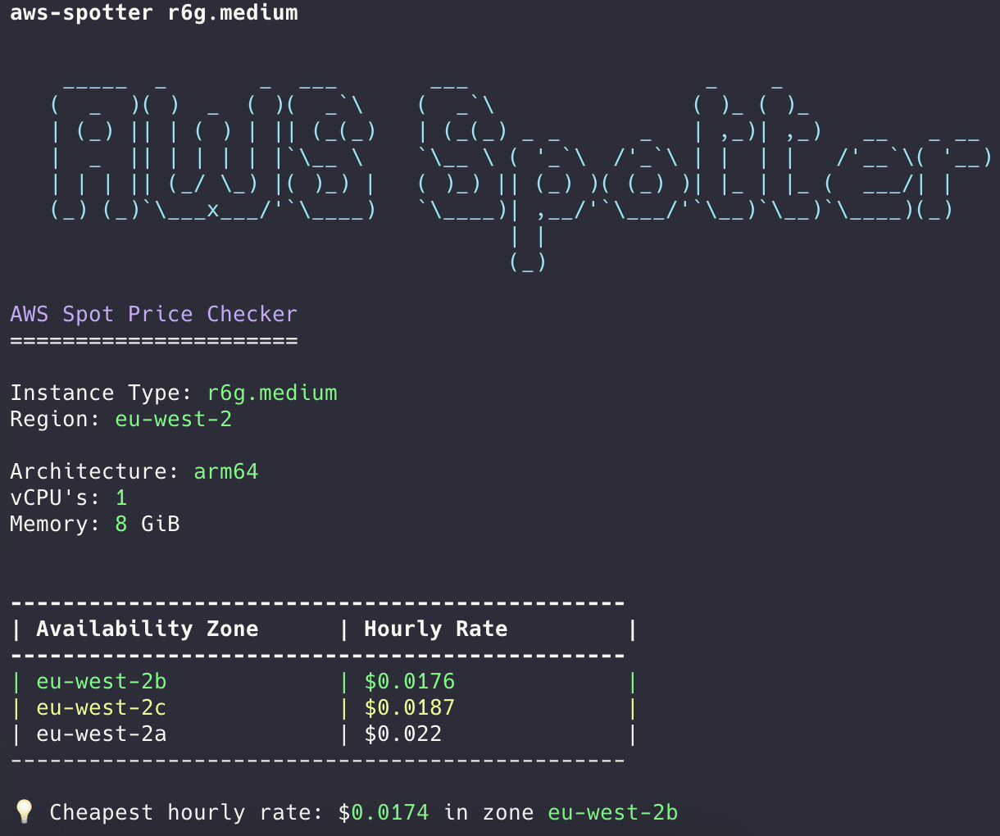

# AWS Spot Price Checker

AWS Spot Price Checker is a Rust-based CLI tool to check the current spot prices of specified EC2 instance types in a particular region. It provides details like architecture, vCPUs, memory, and displays the cheapest hourly rate across availability zones.

### Features:

    Retrieve the current spot prices for specified EC2 instance types.
    Display architecture, vCPUs, and memory information for each instance type.
    List spot prices in various availability zones and highlight the cheapest price.
    Easily specify the region to query.

## Installation
### Prerequisites

    Rust (version 1.58 or later)
    AWS credentials configured via AWS CLI or environment variables.

### Build the Project

Clone the repository and build the project in release mode:

```bash
git clone https://github.com/your-username/aws-spotter.git
cd aws-spotter
cargo build --release
```

This will generate an optimized binary in the target/release directory.
Usage

You can use the tool by running the compiled binary and passing in the required EC2 instance types and optional region:

```bash
./target/release/aws-spotter [INSTANCE_TYPE...] [-r REGION]
```
Example:

```bash
./target/release/aws-spotter m5a.2xlarge t3.micro -r eu-west-2
```

Options:

    [INSTANCE_TYPE...]: One or more EC2 instance types you want to check spot prices for.
    -r, --region [REGION]: (Optional) AWS region to query. Defaults to us-west-2 if not provided.

Sample Output:




### AWS Credentials

Ensure that your AWS credentials are set up properly before using the tool. The tool relies on AWS SDK for Rust, which uses the default credentials provider chain:

    Environment variables (AWS_ACCESS_KEY_ID, AWS_SECRET_ACCESS_KEY)
    Shared credentials file (~/.aws/credentials)
    AWS CLI configuration

For more details, refer to the AWS SDK Documentation.


### Contributing

Feel free to open issues or submit pull requests to improve this tool. Contributions are welcome although this was created for fun so maintaining isn't my highest concern.

### Acknowledgments

Special thanks to the [awespottr](https://github.com/arithmetric/awespottr) repository by [arithmetric](https://github.com/arithmetric) for inspiring this project. 
This project builds upon the idea of fetching and displaying AWS EC2 spot prices in a user-friendly way.

Rusoto: AWS SDK for Rust

Clap: Command-line argument parser

Chrono: Date and time library for Rust

Colored: Terminal text coloring

### License

This project is licensed under the MIT License - see the LICENSE file for details.